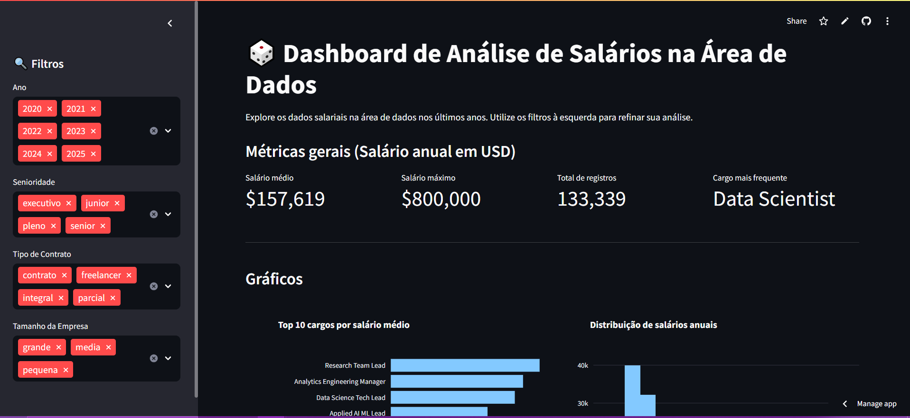
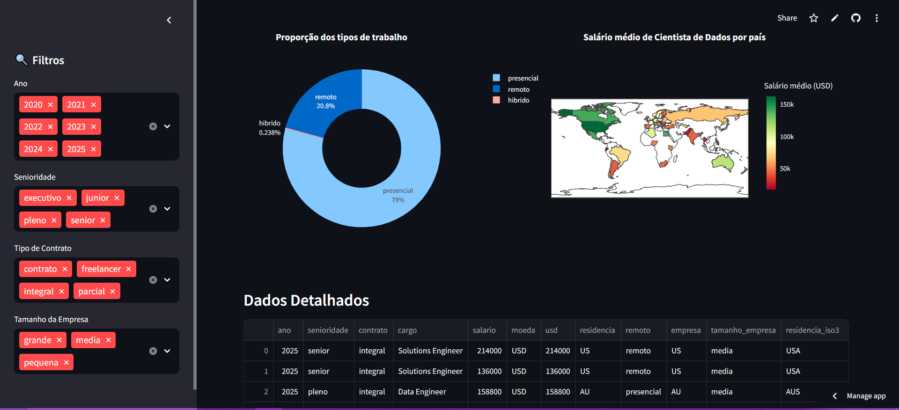

# Imersão Dados com Python - Alura

Este repositório contém o projeto desenvolvido durante a Imersão Dados com Python da Alura. O objetivo da imersão foi aprender a criar dashboards interativos utilizando a biblioteca Streamlit, permitindo a visualização e análise de dados de forma dinâmica.

  

  

## Tecnologias Utilizadas

- Python
- Streamlit
- Pandas
- Plotly

## Estrutura do Projeto

- `app.py`: Arquivo principal que contém o código para o dashboard interativo.
- `requirements.txt`: Lista de bibliotecas necessárias para o funcionamento do projeto.
- `dados_imersao.csv`: Conjunto de dados utilizado para análise.

